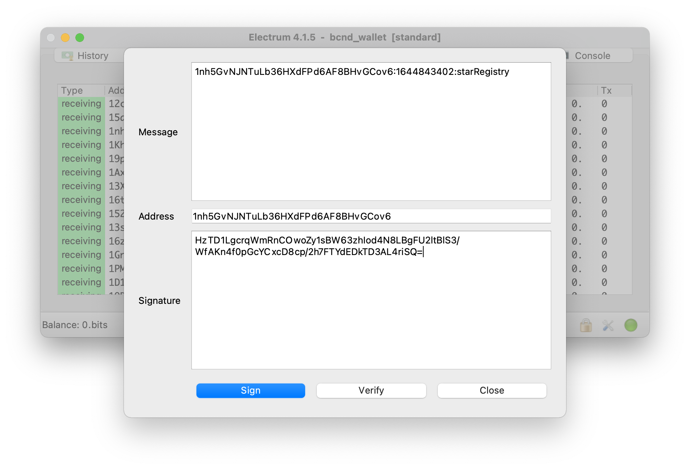
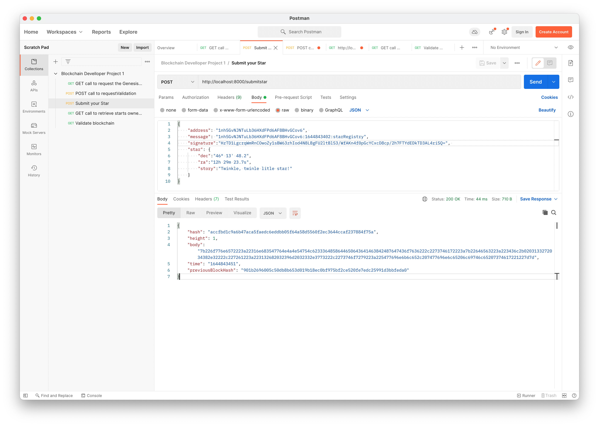
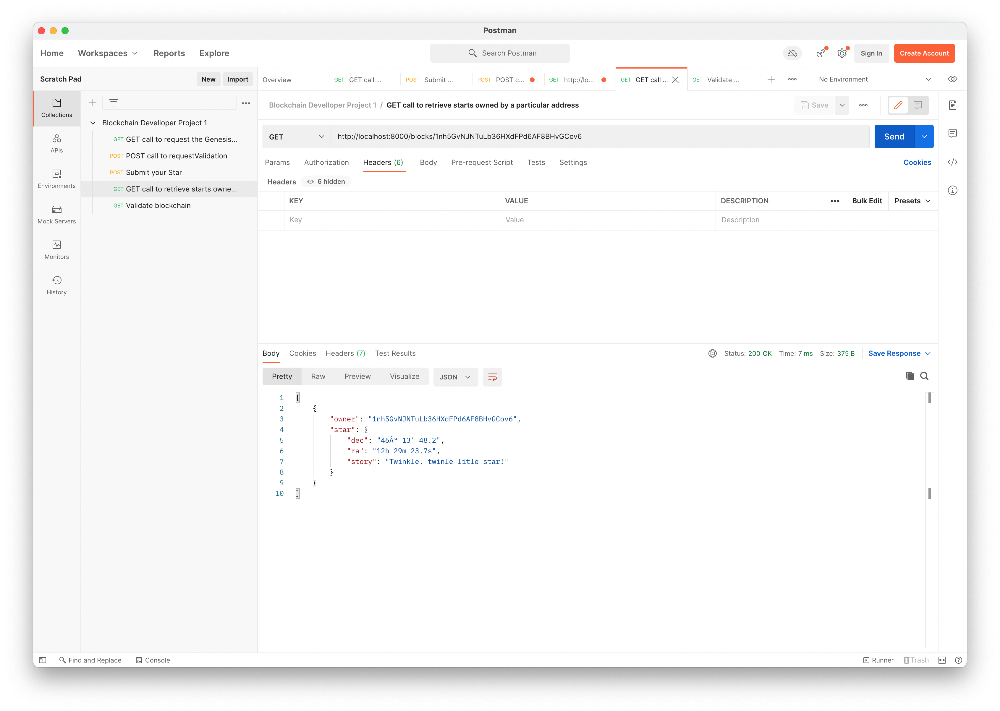
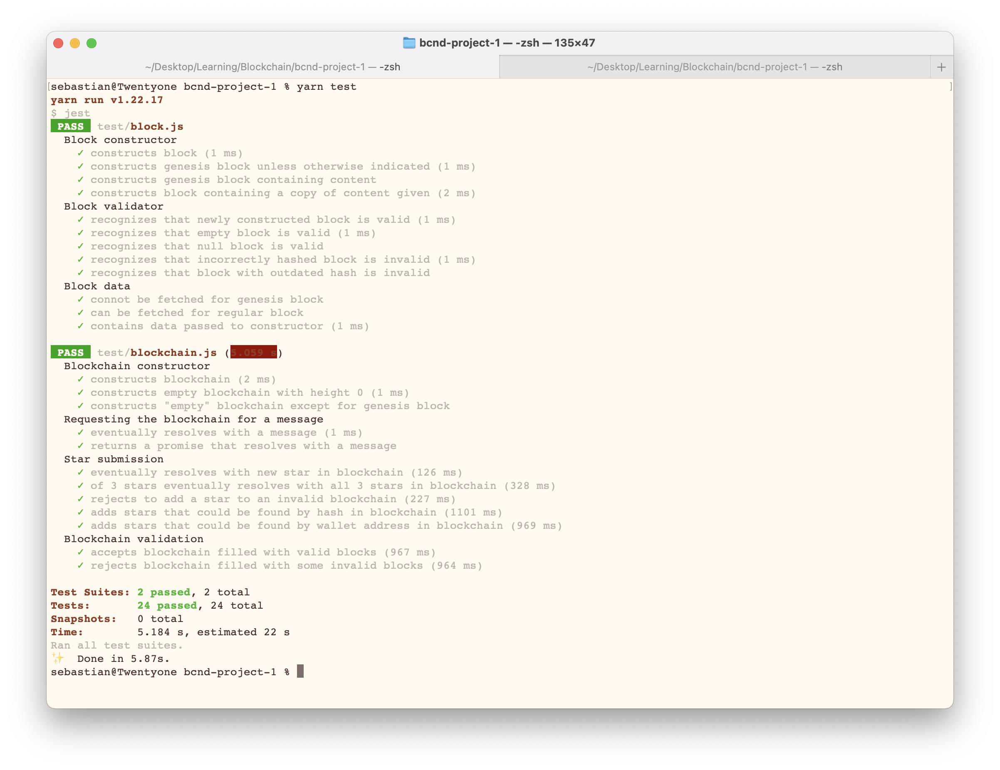

**Blockchain Developer Nanodegree**  
Project 1 Specification

# Create Your Own Private Blockchain

## Test your App functionality (Postman)

Use 'POSTMAN' or similar service to test your blockchains endpoints and send screenshots of each call.

- [x] must use a GET call to request the Genesis block 
- [x] must use a POST call to requestValidation 
- [x] must sign message with your wallet 
- [x] must submit your Star 
- [x] must use GET call to retrieve stars owned by a particular address  
  


## Test your App functionality (Unit Tests)



## Test your App functionality (Command Line)


```
curl http://localhost:8000/validateBlockchain

curl http://localhost:8000/block/height/0

curl -X POST http://localhost:8000/requestValidation -H "Content-Type: application/json" -d '{"address": "12ckHYRzrP1tdv4jf9mL1mPv5H3E8RFKDf"}' 

curl -X POST http://localhost:8000/submitstar -H "Content-Type: application/json" -d '{"address": "12ckHYRzrP1tdv4jf9mL1mPv5H3E8RFKDf", "message": "12ckHYRzrP1tdv4jf9mL1mPv5H3E8RFKDf:2011775400:starRegistry", "signature":"IGxEyUnyf3W3ZhmjlUYv4gbabKkiJzJirWs49ZtxJkb+I2FbLiw/e/bfxYtMzkUkoES795ZvJR8ortSGYrOv92s=", "star": {"dec":"68° 52'' 56.9", "ra":"16h 29m 1.0s", "story":"Twinkle, twinkle little star :-)"}}' 

curl -X POST http://localhost:8000/submitstar -H "Content-Type: application/json" -d '{"address": "16thM3ZKUekL9VSXDXhxmoiaK2UoJeKTuT", "message": "16thM3ZKUekL9VSXDXhxmoiaK2UoJeKTuT:2011775999:starRegistry", "signature":"H156ODVMy50k/tFIisV9tYuuQwnDpdOapsqrblGZmfQIA7SHZYNGlX6h2jg1hC5XbnGoEyOkWYiD7u7+LYxQg00=", "star": {"dec":"57° 31'' 44.8", "ra":"17h 33m 1.8s", "story":"Fast moving star :-o"}}' 

curl http://localhost:8000/blocks/12ckHYRzrP1tdv4jf9mL1mPv5H3E8RFKDf

curl http://localhost:8000/blocks/16thM3ZKUekL9VSXDXhxmoiaK2UoJeKTuT

curl http://localhost:8000/validateBlockchain
```

## Complete unfinished block.js implementation

Modify the `validate()` function to validate if the block has been tampered or not.
	
- [x] Return a new promise to allow the method be called asynchronous. \
- [x] Create an auxiliary variable and store the current hash of the block in it (this represent the block object)
- [x] Recalculate the hash of the entire block (Use SHA256 from crypto-js library)
- [x] Compare if the auxiliary hash value is different from the calculated one.
- [x] Resolve true or false depending if it is valid or not.

Modify the `getBData()` function to return the block body (decoding the data)
	
- [x] Use hex2ascii module to decode the data
- [x] Because data is a Javascript object use JSON.parse(string) to get the Javascript Object
- [x] Resolve with the data and make sure that you don't need to return the data for the genesis block OR reject with an error.

## Complete unfinished blockchain.js implementation

Modify the `_addBlock(block)` function to store a block in the chain
	
- [x] Must return a Promise that will resolve with the block added OR reject if an error happen during the execution.
- [x] height must be checked to assign the previousBlockHash
- [x] assign the timestamp & the correct height
- [x] Create the block hash and push the block into the chain array.
- [x] Don't for get to update the this.height

Modify `requestMessageOwnershipVerification(address)` to allow you to request a message that you will use to sign it with your Bitcoin Wallet (Electrum or Bitcoin Core)

- [x] must return a Promise that will resolve with the message to be signed

Modify `submitStar(address, message, signature, star)` function to register a new Block with the star object into the chain
	
- [x] must resolve with the Block added or reject with an error.
- [x] time elapsed between when the message was sent and the current time must be less that 5 minutes
- [x] must verify the message with wallet address and signature: bitcoinMessage.verify(message, address, signature)
- [x] must create the block and add it to the chain if verification is valid

Modify the `getBlockHeight(hash)` function to retrieve a Block based on the hash parameter

- [x] must return a Promise that will resolve with the Block

Modify the `getStarsByWalletAddress (address)` function to return an array of Stars from an owners collection

- [x] must return a Promise that will resolve with an array of the owner address' Stars from the chain

Modify the `validateChain()` function

- [x] must return a Promise that will resolve with the list of errors when validating the chain
- [x] must validate each block using validate()
- [x] Each Block should check with the previousBlockHash
- [x] execute the validateChain() function every time a block is added
- [x] create an endpoint that will trigger the execution of validateChain()

